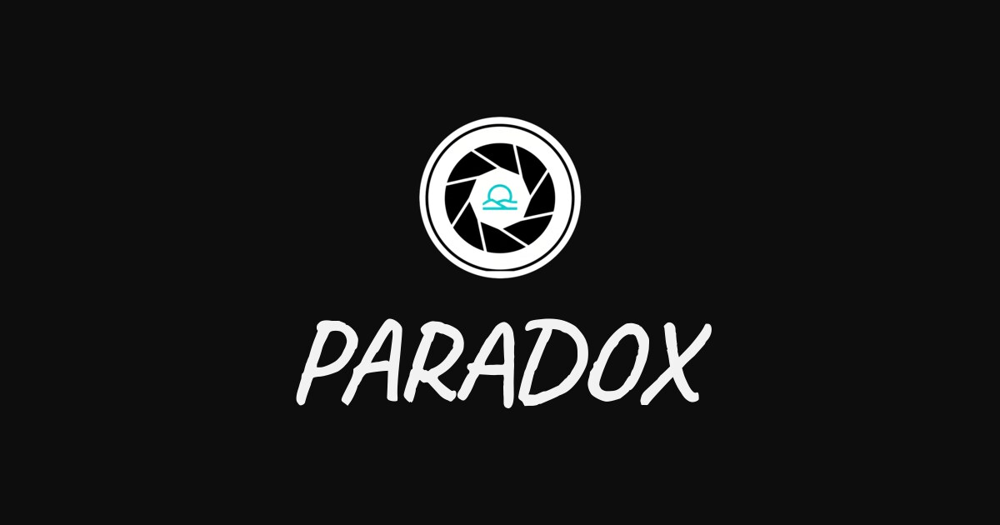

# PARADOX — Image Gallery

A static, dependency-free reference board: 32 pieces of graphic, type and web design collected around one argument about time, each credited to its author.


[](https://www.fiverr.com/pablonietop)




## Description

PARADOX is a single-page gallery built without a framework, a bundler or a
package manager. It exists to hold a curated set of design work — posters, type
specimens, brand collateral, website captures and architectural photography —
grouped by the idea they share: that time is finite and unevenly felt.

The interface stays deliberately quiet. A dark ground, one display face for the
wordmark and pull-quote, a system stack for everything else, and a grid that
gets out of the way of the work.

**The pieces in this collection were not made by the author of this repository.**
They were gathered as reference. Every card names the studio or designer behind
it, and the About section lists each source in full. Four pieces carry no author
mark and are labelled as unidentified rather than left blank. If you are one of
the authors and want a piece removed, the contact link on the page reaches the
maintainer directly.

## Features

- 32 pieces in a responsive grid, filterable by six groupings.
- Per-piece attribution rendered in the markup, not injected by script.
- Lightbox with keyboard navigation (arrows, `Escape`), a focus trap and focus
  restoration; it steps only through the currently filtered set.
- Mobile menu that closes on link choice, on `Escape` and on reaching the
  desktop breakpoint, locking background scroll while open.
- Works with JavaScript disabled — the full collection is in the HTML; script
  only adds filtering and the lightbox.
- Self-hosted subsetted fonts: no third-party requests anywhere on the page.

## Tech stack

| Layer | Technology | Role in project |
|---|---|---|
| Markup | HTML5 | `index.html` (1,023 lines) and `404.html` |
| Styling | CSS3, custom properties | 3 files, ~984 lines, 28 KB — tokens, layout, components |
| Scripting | Vanilla JS (ES5-compatible syntax) | 5 files, ~352 lines, 21 KB — one entry point plus 4 modules |
| Typography | Caveat, self-hosted | 2 subsetted WOFF2 files, 100 KB total |
| Imagery | WebP | 32 pieces, 2.4 MB on disk; 626 KB on first load |
| Tooling | None | No `package.json`, no build, no dependencies |

### Why classic scripts instead of ES modules

`main.js` and its modules load as deferred classic scripts sharing a single
`window.Paradox` namespace, rather than as ES modules. ES modules are blocked by
CORS over the `file://` protocol, which would mean the page could only run
behind a server. The current arrangement keeps one entry point and separate
module files while letting `index.html` open correctly straight off disk.

## Project structure

```
.
├── index.html              # The board: hero, collection, credits, contact
├── 404.html                # Error page, links back to the board
├── robots.txt              # Allows all crawlers, points at the sitemap
├── sitemap.xml             # Single canonical URL
├── assets/
│   ├── css/
│   │   ├── base.css        # Tokens, reset, typography, a11y utilities
│   │   ├── layout.css      # Container, header, sections, grid, footer
│   │   └── components.css  # Buttons, filters, cards, lightbox
│   ├── js/
│   │   ├── main.js         # Entry point — runs the initialisers
│   │   └── modules/
│   │       ├── scroll-lock.js  # Reference-counted body scroll lock
│   │       ├── nav.js          # Mobile menu
│   │       ├── gallery.js      # Grouping filter
│   │       └── lightbox.js     # Full-size viewer
│   ├── img/
│   │   ├── content/        # 32 WebP pieces, semantically named
│   │   ├── logo/           # Favicon and touch icon
│   │   └── og-cover.jpg    # Open Graph card, 1200×630
│   └── fonts/
│       ├── caveat-regular.woff2
│       ├── caveat-bold.woff2
│       └── caveat-OFL.txt  # SIL Open Font License, required on redistribution
└── docs/
    ├── auditoria.md        # Audit of the project before reorganisation
    └── cambios.md          # Change log, grouped by phase
```

## Running it locally

No install step. Either works:

```bash
# Straight off disk
start index.html          # Windows
open index.html           # macOS

# Or over HTTP
npx serve .
```

Both are supported. HTTP is closer to production and is what the deployed site
uses; opening the file directly is enough for a quick look.

## Adding a piece

1. Put the image in `assets/img/content/` as WebP, no wider than 800 px, named
   for what it shows.
2. Copy an existing `<figure class="card">` block in `index.html`, and set
   `data-collection`, `src`, `width`, `height`, `alt`, the title and the credit.
3. Add `loading="lazy"` unless the piece sits in the first row.
4. Update the count on the matching filter button and on `All`.

There is no manifest and no build; markup order is page order.

## Deployment

Static hosting, no build command and no output directory — upload the
repository root as-is. The canonical URL in `index.html`, `robots.txt` and
`sitemap.xml` is `https://pablowib.github.io/Paradox-Image-Gallery/`; change all three
together if the domain changes.

For the 404 page to be served on a not-found response, point the host's error
document at `404.html`. On GitHub Pages and Netlify this is automatic for a static
site with `404.html` in the root.

## Licensing

The Caveat typeface is used under the SIL Open Font License; the licence text
ships in `assets/fonts/caveat-OFL.txt`.

The collected pieces in `assets/img/content/` remain the property of their
respective authors and are reproduced here as credited reference, not as work of
this repository's author. They are not covered by any licence granted by this
repository.

## Author

**Pablo Nieto Pérez** — [wib.digital](https://wib.digital)
GitHub: [@pabloWIB](https://github.com/pabloWIB)

## Hire me

I build **custom internal tools, CRMs and dashboards** for small teams, and
**conversion-focused websites** for businesses.

- [Custom internal tool, CRM or dashboard](https://www.fiverr.com/pablonietop/build-a-custom-internal-app-for-your-business) — from $45
- [Conversion-focused website](https://www.fiverr.com/pablonietop/convert-your-landing-page-design-to-code) — from $80
- [All my services on Fiverr](https://www.fiverr.com/pablonietop)
- [wib.digital](https://wib.digital)
